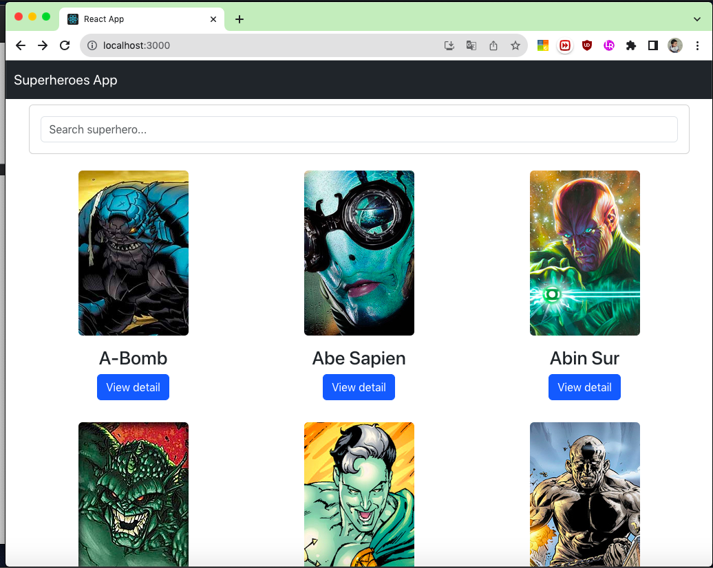
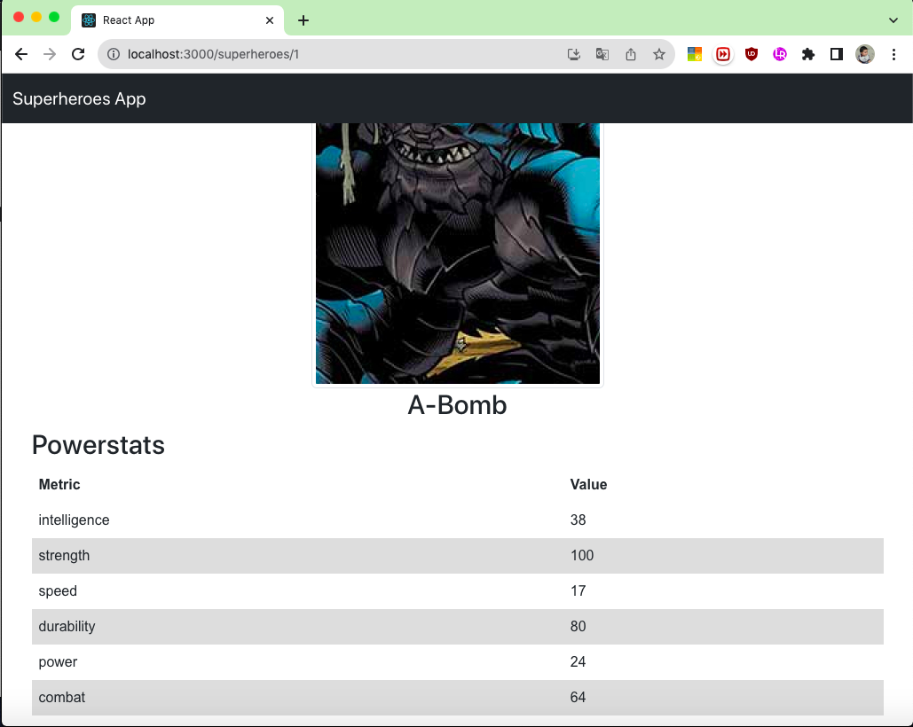

# super-heroes
This application allows users to display a list of superheroes and view their main features.

## Development environment tools
- Git
- Node.js
- Visual Studio Code or any other editor

## Running the backend app:
Download the dependencies:
 ```
npm install
```
Builds the TypeScript files and generates the JavaScript files using the TypeScript compiler
```
npm run build 
```
Starts the server using the compiled JavaScript file in the 'dist' directory
``````
npm start 
``````

## Running the frontend app:
```
npm install
```
```
npm run build
```
```
npm start
```

## After both applications are running, we can access the application from the browser using the following URL:
http://localhost:3000

## Aplication Screenshots:
### Superhero List


### Superhero Details:


